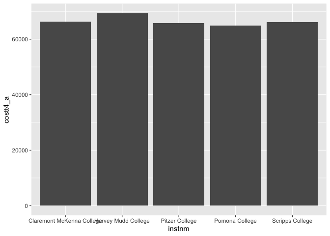
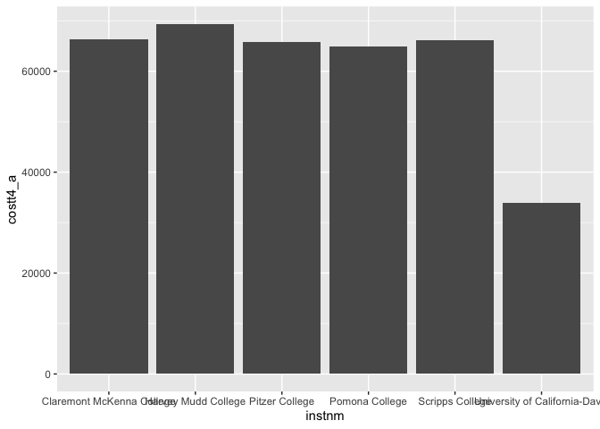
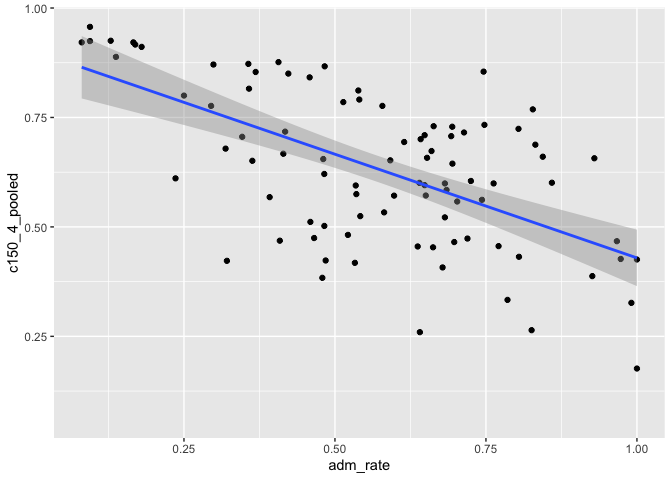
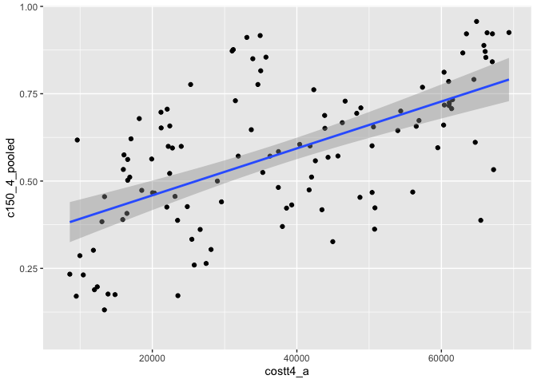

## Instructions
Answer the following questions and complete the exercises in RMarkdown. Please embed all of your code and push your final work to your repository. Your final lab report should be organized, clean, and run free from errors. Remember, you must remove the `#` for the included code chunks to run. Be sure to add your name to the author header above.  

Make sure to use the formatting conventions of RMarkdown to make your report neat and clean!  

## Load the libraries

```r
library(tidyverse)
library(janitor)
library(here)
library(naniar)
```

For this homework, we will take a departure from biological data and use data about California colleges. These data are a subset of the national college scorecard (https://collegescorecard.ed.gov/data/). Load the `ca_college_data.csv` as a new object called `colleges`.

```r
colleges<-read_csv("data/ca_college_data.csv")
```

```
## Rows: 341 Columns: 10
## ── Column specification ────────────────────────────────────────────────────────
## Delimiter: ","
## chr (4): INSTNM, CITY, STABBR, ZIP
## dbl (6): ADM_RATE, SAT_AVG, PCIP26, COSTT4_A, C150_4_POOLED, PFTFTUG1_EF
## 
## ℹ Use `spec()` to retrieve the full column specification for this data.
## ℹ Specify the column types or set `show_col_types = FALSE` to quiet this message.
```

The variables are a bit hard to decipher, here is a key:  

INSTNM: Institution name  
CITY: California city  
STABBR: Location state  
ZIP: Zip code  
ADM_RATE: Admission rate  
SAT_AVG: SAT average score  
PCIP26: Percentage of degrees awarded in Biological And Biomedical Sciences  
COSTT4_A: Annual cost of attendance  
C150_4_POOLED: 4-year completion rate  
PFTFTUG1_EF: Percentage of undergraduate students who are first-time, full-time degree/certificate-seeking undergraduate students  

1. Use your preferred function(s) to have a look at the data and get an idea of its structure. Make sure you summarize NA's and determine whether or not the data are tidy. You may also consider dealing with any naming issues.

```r
glimpse(colleges)
```

```
## Rows: 341
## Columns: 10
## $ INSTNM        <chr> "Grossmont College", "College of the Sequoias", "College…
## $ CITY          <chr> "El Cajon", "Visalia", "San Mateo", "Ventura", "Oxnard",…
## $ STABBR        <chr> "CA", "CA", "CA", "CA", "CA", "CA", "CA", "CA", "CA", "C…
## $ ZIP           <chr> "92020-1799", "93277-2214", "94402-3784", "93003-3872", …
## $ ADM_RATE      <dbl> NA, NA, NA, NA, NA, NA, NA, NA, NA, NA, NA, NA, NA, NA, …
## $ SAT_AVG       <dbl> NA, NA, NA, NA, NA, NA, NA, NA, NA, NA, NA, NA, NA, NA, …
## $ PCIP26        <dbl> 0.0016, 0.0066, 0.0038, 0.0035, 0.0085, 0.0151, 0.0000, …
## $ COSTT4_A      <dbl> 7956, 8109, 8278, 8407, 8516, 8577, 8580, 9181, 9281, 93…
## $ C150_4_POOLED <dbl> NA, NA, NA, NA, NA, NA, 0.2334, NA, NA, NA, NA, 0.1704, …
## $ PFTFTUG1_EF   <dbl> 0.3546, 0.5413, 0.3567, 0.3824, 0.2753, 0.4286, 0.2307, …
```

```r
colleges<-clean_names(colleges)

names(colleges)
```

```
##  [1] "instnm"        "city"          "stabbr"        "zip"          
##  [5] "adm_rate"      "sat_avg"       "pcip26"        "costt4_a"     
##  [9] "c150_4_pooled" "pftftug1_ef"
```

```r
miss_var_summary(colleges) 
```

```
## # A tibble: 10 × 3
##    variable      n_miss pct_miss
##    <chr>          <int>    <dbl>
##  1 sat_avg          276     80.9
##  2 adm_rate         240     70.4
##  3 c150_4_pooled    221     64.8
##  4 costt4_a         124     36.4
##  5 pftftug1_ef       53     15.5
##  6 pcip26            35     10.3
##  7 instnm             0      0  
##  8 city               0      0  
##  9 stabbr             0      0  
## 10 zip                0      0
```

2. Which cities in California have the highest number of colleges?

```r
city_by_col<-
colleges %>%
  group_by(city) %>%
  select(city,stabbr ) %>%
  summarize(num_col=n()) %>%
  arrange(desc(num_col)) %>%
head(n=10)
city_by_col
```

```
## # A tibble: 10 × 2
##    city          num_col
##    <chr>           <int>
##  1 Los Angeles        24
##  2 San Diego          18
##  3 San Francisco      15
##  4 Sacramento         10
##  5 Berkeley            9
##  6 Oakland             9
##  7 Claremont           7
##  8 Pasadena            6
##  9 Fresno              5
## 10 Irvine              5
```

```r
#LA has the most 
```

3. Based on your answer to #2, make a plot that shows the number of colleges in the top 10 cities.

```r
city_by_col %>%
  ggplot(aes(x=city,y=num_col))+geom_col()
```

<!-- -->

4. The column `COSTT4_A` is the annual cost of each institution. Which city has the highest average cost? Where is it located?

```r
cost<- colleges %>%
  group_by(city) %>%
  select(city,costt4_a) %>%
  summarize(avg_cost=mean(costt4_a,na.rm=T,Nan.rm=T))%>%
  arrange(desc(avg_cost))
cost
```

```
## # A tibble: 161 × 2
##    city                avg_cost
##    <chr>                  <dbl>
##  1 Claremont              66498
##  2 Malibu                 66152
##  3 Valencia               64686
##  4 Orange                 64501
##  5 Redlands               61542
##  6 Moraga                 61095
##  7 Atherton               56035
##  8 Thousand Oaks          54373
##  9 Rancho Palos Verdes    50758
## 10 La Verne               50603
## # ℹ 151 more rows
```

```r
#claremont has the highest avg cost (Los angeles)
```

5. Based on your answer to #4, make a plot that compares the cost of the individual colleges in the most expensive city. Bonus! Add UC Davis here to see how it compares :>).

```r
claremont<-colleges %>%
  filter(city=="Claremont") %>%
  select(costt4_a,instnm)
claremont
```

```
## # A tibble: 7 × 2
##   costt4_a instnm                       
##      <dbl> <chr>                        
## 1    64870 Pomona College               
## 2    65880 Pitzer College               
## 3    66060 Scripps College              
## 4    66325 Claremont McKenna College    
## 5    69355 Harvey Mudd College          
## 6       NA Claremont Graduate University
## 7       NA Claremont School of Theology
```

```r
colleges %>%
  select(instnm,costt4_a,city) %>%
  filter(city=="Claremont",costt4_a>10) %>%
  ggplot(aes(x=instnm,y=costt4_a))+geom_col()
```

<!-- -->


```r
#With Davis included
colleges %>%
  select(instnm,costt4_a,city)%>%
  filter(city=="Davis" | city=="Claremont",costt4_a>10) %>%
  ggplot(aes(x=instnm,y=costt4_a))+geom_col()
```

<!-- -->


6. The column `ADM_RATE` is the admissions rate by college and `C150_4_POOLED` is the four-year completion rate. Use a scatterplot to show the relationship between these two variables. What do you think this means?

```r
colleges %>%
  ggplot(aes(x=adm_rate,y=c150_4_pooled))+geom_point()+geom_smooth(method=lm,se=T)
```

```
## `geom_smooth()` using formula = 'y ~ x'
```

```
## Warning: Removed 251 rows containing non-finite values (`stat_smooth()`).
```

```
## Warning: Removed 251 rows containing missing values (`geom_point()`).
```

<!-- -->

7. Is there a relationship between cost and four-year completion rate? (You don't need to do the stats, just produce a plot). What do you think this means?

```r
colleges %>%
  ggplot(aes(x=costt4_a,y=c150_4_pooled))+geom_point()+geom_smooth(method=lm,se=T)
```

```
## `geom_smooth()` using formula = 'y ~ x'
```

```
## Warning: Removed 225 rows containing non-finite values (`stat_smooth()`).
```

```
## Warning: Removed 225 rows containing missing values (`geom_point()`).
```

<!-- -->

```r
#the scatterplot implies that the higher the cost the higher the completion rate.
```

8. The column titled `INSTNM` is the institution name. We are only interested in the University of California colleges. Make a new data frame that is restricted to UC institutions. You can remove `Hastings College of Law` and `UC San Francisco` as we are only interested in undergraduate institutions.

```r
uconly<- colleges %>%
 # filter(instm,contains=="University of California")
  filter(grepl("University of California",instnm)) %>%
  filter(instnm!="University of California-Hastings College of Law",instnm!="University of California-San Francisco")
uconly
```

```
## # A tibble: 8 × 10
##   instnm       city  stabbr zip   adm_rate sat_avg pcip26 costt4_a c150_4_pooled
##   <chr>        <chr> <chr>  <chr>    <dbl>   <dbl>  <dbl>    <dbl>         <dbl>
## 1 University … La J… CA     92093    0.357    1324  0.216    31043         0.872
## 2 University … Irvi… CA     92697    0.406    1206  0.107    31198         0.876
## 3 University … Rive… CA     92521    0.663    1078  0.149    31494         0.73 
## 4 University … Los … CA     9009…    0.180    1334  0.155    33078         0.911
## 5 University … Davis CA     9561…    0.423    1218  0.198    33904         0.850
## 6 University … Sant… CA     9506…    0.578    1201  0.193    34608         0.776
## 7 University … Berk… CA     94720    0.169    1422  0.105    34924         0.916
## 8 University … Sant… CA     93106    0.358    1281  0.108    34998         0.816
## # ℹ 1 more variable: pftftug1_ef <dbl>
```

Remove `Hastings College of Law` and `UC San Francisco` and store the final data frame as a new object `univ_calif_final`.

```r
univ_calif_final<-uconly
```

Use `separate()` to separate institution name into two new columns "UNIV" and "CAMPUS".

```r
univ_calif_final<-univ_calif_final %>%

    separate(instnm,into=c("univ","campus"),sep="-")
univ_calif_final
```

```
## # A tibble: 8 × 11
##   univ  campus city  stabbr zip   adm_rate sat_avg pcip26 costt4_a c150_4_pooled
##   <chr> <chr>  <chr> <chr>  <chr>    <dbl>   <dbl>  <dbl>    <dbl>         <dbl>
## 1 Univ… San D… La J… CA     92093    0.357    1324  0.216    31043         0.872
## 2 Univ… Irvine Irvi… CA     92697    0.406    1206  0.107    31198         0.876
## 3 Univ… River… Rive… CA     92521    0.663    1078  0.149    31494         0.73 
## 4 Univ… Los A… Los … CA     9009…    0.180    1334  0.155    33078         0.911
## 5 Univ… Davis  Davis CA     9561…    0.423    1218  0.198    33904         0.850
## 6 Univ… Santa… Sant… CA     9506…    0.578    1201  0.193    34608         0.776
## 7 Univ… Berke… Berk… CA     94720    0.169    1422  0.105    34924         0.916
## 8 Univ… Santa… Sant… CA     93106    0.358    1281  0.108    34998         0.816
## # ℹ 1 more variable: pftftug1_ef <dbl>
```

9. The column `ADM_RATE` is the admissions rate by campus. Which UC has the lowest and highest admissions rates? Produce a numerical summary and an appropriate plot.

```r
univ_calif_final%>%
  select(campus,adm_rate)%>%
  ggplot(aes(x=campus,y=adm_rate))+geom_col()
```

<!-- -->

```r
univ_calif_final %>%
  select(campus,adm_rate) %>%
  group_by(adm_rate) %>%
  arrange(desc(adm_rate))
```

```
## # A tibble: 8 × 2
## # Groups:   adm_rate [8]
##   campus        adm_rate
##   <chr>            <dbl>
## 1 Riverside        0.663
## 2 Santa Cruz       0.578
## 3 Davis            0.423
## 4 Irvine           0.406
## 5 Santa Barbara    0.358
## 6 San Diego        0.357
## 7 Los Angeles      0.180
## 8 Berkeley         0.169
```

```r
#UC Riverside has the highest and UC Berkeley has the lowest
```

10. If you wanted to get a degree in biological or biomedical sciences, which campus confers the majority of these degrees? Produce a numerical summary and an appropriate plot.

```r
univ_calif_final %>%
  select(pcip26,campus) %>%
  arrange(desc(pcip26)) 
```

```
## # A tibble: 8 × 2
##   pcip26 campus       
##    <dbl> <chr>        
## 1  0.216 San Diego    
## 2  0.198 Davis        
## 3  0.193 Santa Cruz   
## 4  0.155 Los Angeles  
## 5  0.149 Riverside    
## 6  0.108 Santa Barbara
## 7  0.107 Irvine       
## 8  0.105 Berkeley
```


```r
univ_calif_final%>%
  ggplot(aes(x=campus,y=pcip26))+geom_col()
```

<!-- -->

```r
#San diego leads, followed by davis and santa cruz
```

## Knit Your Output and Post to [GitHub](https://github.com/FRS417-DataScienceBiologists)
